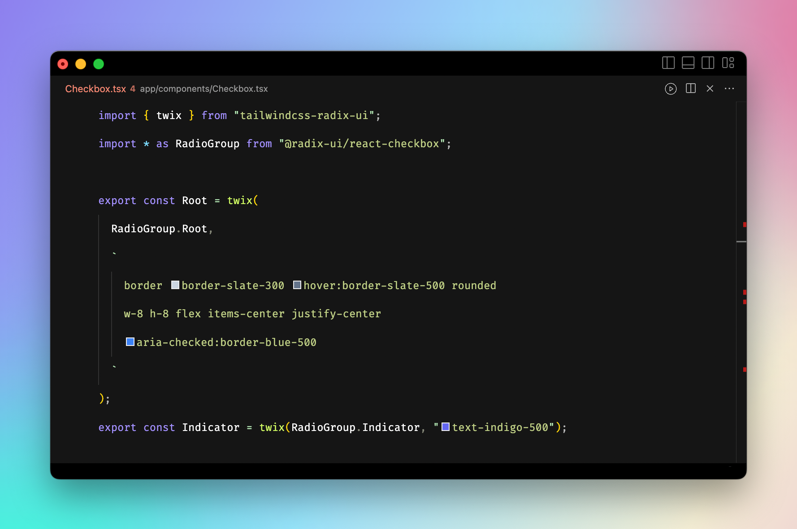

# tailwindcss-radix-ui



<p align="center">
Style Radix UI components with TailwindCSS
</p>

<br />

<p align="center">
  <a href="https://codesandbox.io/s/tailwindcss-radix-ui-jnfckh?fontsize=14&hidenavigation=1&theme=dark">
    
  </a>
</p>

<p align="center">
  <a href="https://twitter.com/intent/follow/?screen_name=Idered">
    
  </a>
</p>

## Install

```sh
npm i tailwindcss-radix-ui
```

To get IntelliSense working, add this to your Visual Studio Config:

```json
"tailwindCSS.experimental.classRegex": [
  "twix\\([\\s\\S]*?'([^']*)'\\s?\\)",
  "twix\\([\\s\\S]*?\"([^\"]*)\"\\s?\\)",
  "twix\\([\\s\\S]*?`([^`]*)`\\s?\\)"
]
```

## Usage

```tsx
// components/checkbox.tsx
import { twix } from "tailwindcss-radix-ui";
import * as Checkbox from "@radix-ui/react-checkbox";

export const Root = twix(
  Checkbox.Root,
  "border border-slate-300 hover:border-slate-500 rounded w-8 h-8 flex items-center justify-center aria-checked:border-blue-500"
);

export const Indicator = twix(Checkbox.Indicator, "text-indigo-500");
```

```tsx
// app.tsx
import * as Checkbox from "./components/checkbox.tsx";
import { CheckIcon } from "@radix-ui/react-icons";

export default () => {
  return (
    <div>
      <Checkbox.Root>
        <Checkbox.Indicator>
          <CheckIcon />
        </Checkbox.Indicator>
      </Checkbox.Root>
    </div>
  );
};
```

## Styling based on state

Use [ARIA states](https://tailwindcss.com/docs/hover-focus-and-other-states#aria-states).
